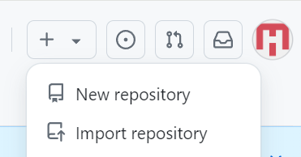
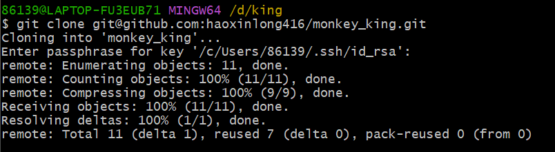

# 创建远程仓库教程：monkey.king

## 步骤 1：注册 GitHub 账号

## 步骤 2：创建新的远程仓库

登录GitHub 账号,点击右上角的“+”号，选择“New repository”。

## 步骤3：建本地的版本

进入，右键-Git Bash-输入“git init”初始化成一个Git可管理的仓库

## 步骤4：查看当前的状态

命令：git status

红字表示未add到Git仓库上的文件
绿字表示已add到Git仓库上的文件

## 步骤5：生成密钥

github填写ssh-key

## 步骤6：提交仓库

用git commit把项目提交到仓库。

## 步骤7：关联远程仓库与本地内容上传推送

根据创建好的Git仓库页面的提示，在本地仓库的命令行输入

关联好之后我们就可以把本地库的所有内容推送到远程仓库上了

## 步骤8：邀请小组成员加入

## 步骤9：小组成员进行拉取

小组成员可以成功拉取并上传文件

