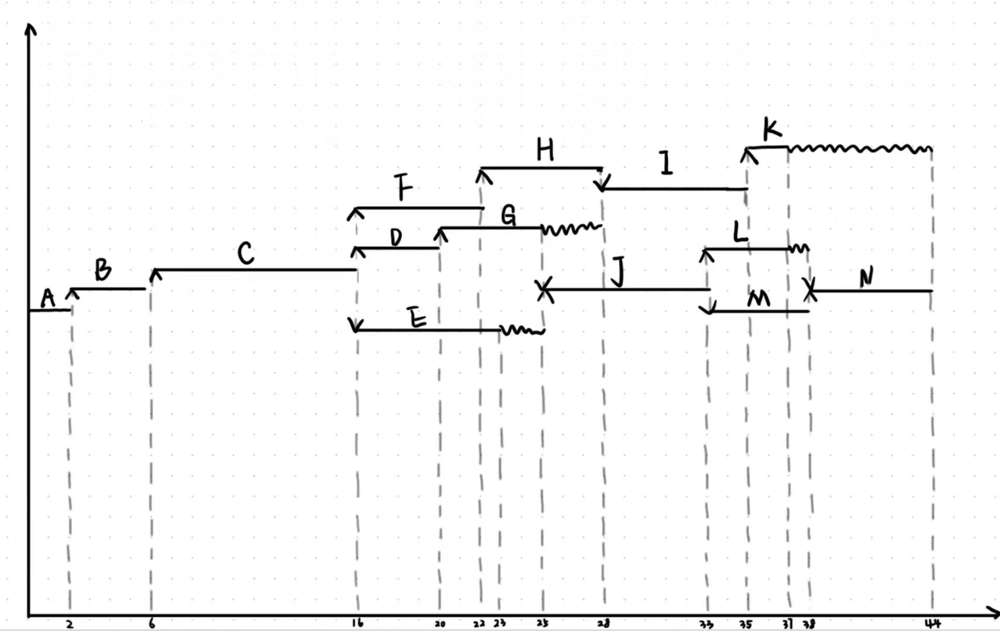
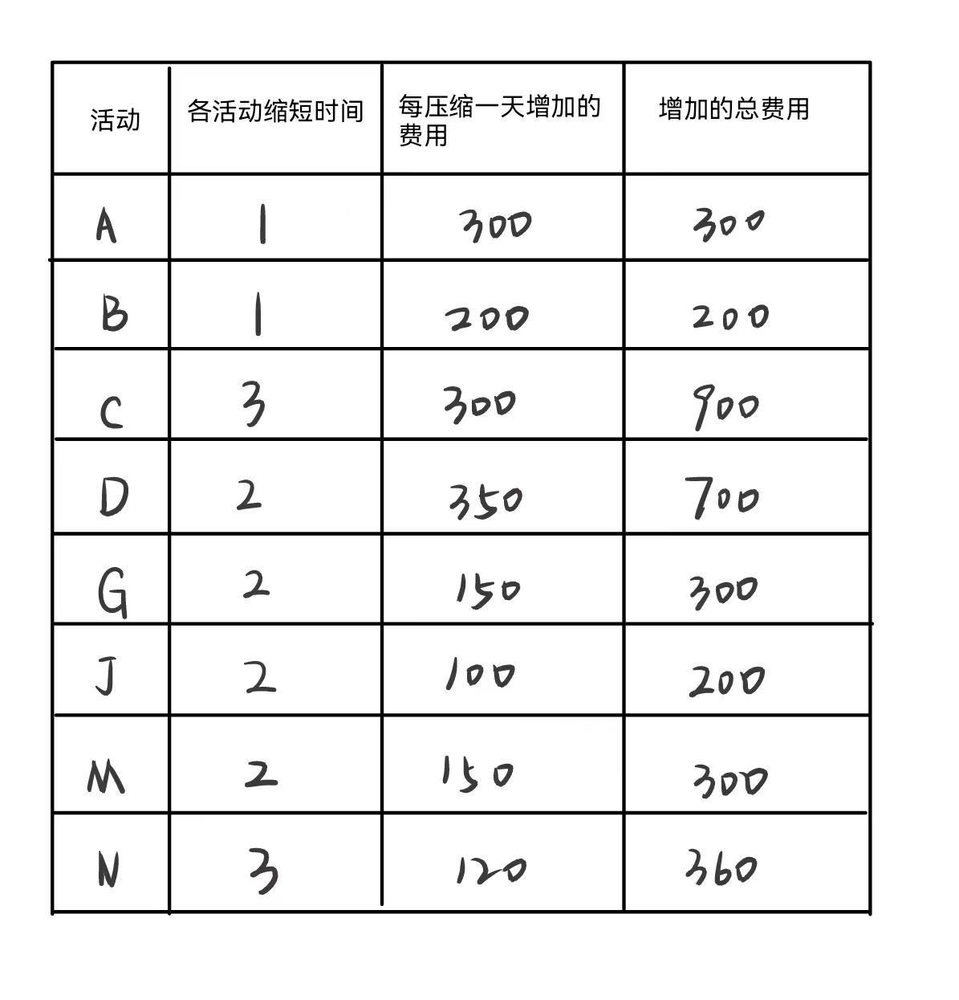

下图给出了一个信息系统项目的进度网络图

 

下表给出了该项目各项作业正常工作与赶工工作的时间和费用

| 活动 | 正常工作 |         | 赶工工作 |         |
| ---- | -------- | :-----: | -------- | ------- |
|      | 时间/天  | 费用/元 | 时间/天  | 费用/元 |
| A    | 2        |  1200   | 1        | 1500    |
| B    | 4        |  2500   | 3        | 2700    |
| C    | 10       |  5500   | 7        | 6400    |
| D    | 4        |  3400   | 2        | 4100    |
| E    | 7        |  1400   | 5        | 1600    |
| F    | 6        |  1900   | 4        | 2200    |
| G    | 5        |  1100   | 3        | 1400    |
| H    | 6        |  9300   | 4        | 9900    |
| I    | 7        |  1300   | 5        | 1700    |
| J    | 8        |  4600   | 6        | 4800    |
| K    | 2        |   300   | 1        | 400     |
| L    | 4        |   900   | 3        | 1000    |
| M    | 5        |  1800   | 3        | 2100    |
| N    | 6        |  2600   | 3        | 2960    |

【问题1】（3分）

请给出项目关键路径

**关键路径：ABCDGJMN**

【问题2】（3分）

请计算项目总工期

**由图可知，总工期为44天**

【问题3】（19分）

（1）请计算关键路径上各活动的可缩短时间，每缩短一天增加的费用和增加的总费用。将关键路径上各活动的名称以及对应的计算结果填入答题纸相对应的表格中

（2）如果项目工期要求缩短到38天，请给出具体的工期压缩方案并计算需要增加的最少费用。

**由上图可知，J缩短两天增加的费用为200，N缩短三天增加的费用为360，G和M的费用均为缩短一天150元，所以可选择G和M中任一活动缩短一天。缩短到38天增加的最少费用为200+360+150=710元**