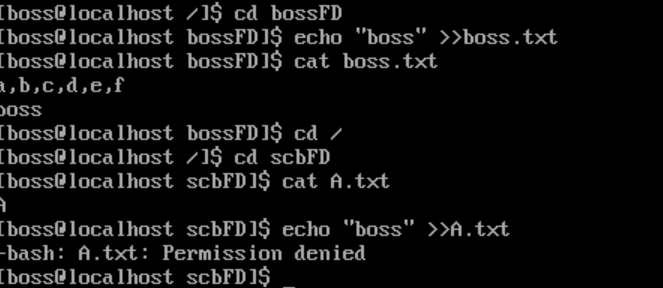
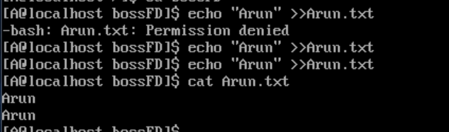
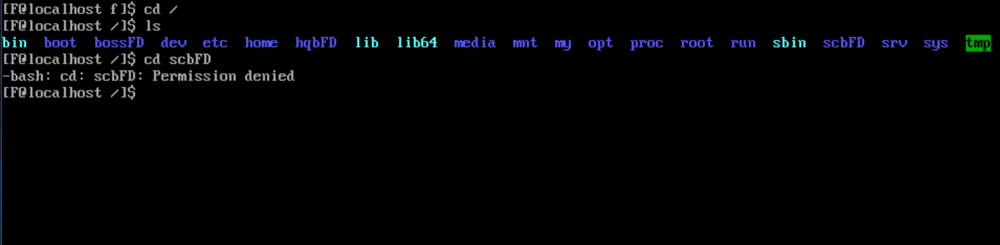
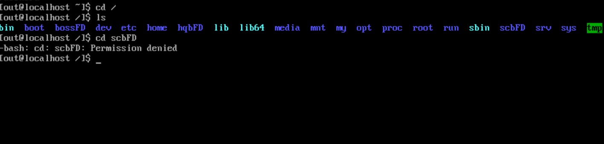

# LINUX

### 一、创建过程

1.创建组

`groupadd scb`

`groupadd yfb`

`groupadd hqb`

``groupadd company``

2.创建用户并指定组

`useradd -g scb -G company A`

`useradd -g scb -G company B`

`useradd -g yfb -G company C`

`useradd -g yfb -G company D`

`useradd -g hqb -G company E`

`useradd -g hqb -G company F`

3.创建并给部门目录赋权（提前使用umask改变权限）

`umask 007`

`mkdir scbFD`

`mkdir yfbFD`

`mkdir hqbFD`

4.修改部门目录的属主(boss)和属组(各自部门)

`chown boss:scb scbFD`

`chown boss:yfb yfbFD`

`chown boss:hqb hqbFD`

5.登录各用户，进入各自部门，创建并给自己的文件夹赋权（提前使用umask改变权限）

`umask 026`

`cd /scbFD`

`mkdir A`

`cd A`

`echo "woshiA" >> A.txt`

6.登录boss用户赋予权限改变权限（使用umask）

`umask 026`

7.创建boss文件

`echo "woshiboss" >> boss.txt`

### 二、验证过程

1.boss对boosFD（公司文件夹）进行读写修改操作

2.boss访问市场部内A员工所写的文件，可读不可写

3.f员工访问市场部内文件失败

4.a员工在公司文件里进行发送公告，其他人同上

5.b员工访问同在市场部a员工的文件

6.out（外部用户）对公司内部文件无任何权限

