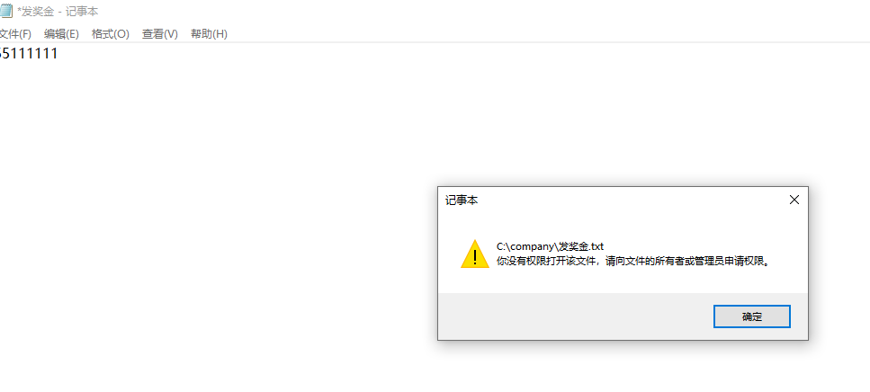

# Windows

1.创建用户

  （1）建立boss用户

  （2）创建七个部门用户

2.创建文件夹，命名company

3.在company下创建三个部门：市场，研发，后勤

4.在市场部的文件夹里添加所有用户，将市场部成员权限设为完全控制，其他成员设为可读；

在研发部的文件夹里添加所有用户，将市场部成员权限设为完全控制，其他成员设为可读；

在后勤部的文件夹里添加所有用户，将市场部成员权限设为完全控制，其他成员设为可读。

5.company文件夹添加所有用户，将boss权限设为可读可写，其他成员设为可读

6.验证

分别在company，scb，yfb，hqb，编辑三个文本文档

登录boss用户 进入company查看发奖金文档,boss可以写入并读取company的文档

boss只能读取其他部门的文档，切换用户为其他部门成员

其他部门用户成员只能读取company的文档，不能修改, 部门之间也只能相互读取，不能修改 

本部门只能修改本部门的文档

