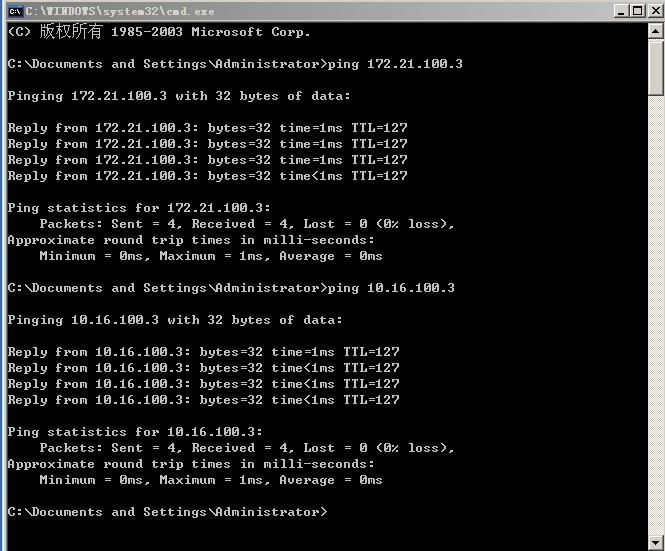

一、配置文件

1、配置网卡

配置inner网段网关主机IP分别为：192.168.100.0、192.168.100.2、192.168.100.3

配置DMZ网段网关主机IP分别为：172.21.100.0、172.21.100.2、172.21.100.3

配置outer网段网关主机IP分别为：10.16.100.0、10.16.100.2、10.16.100.3

配置outer第二块网卡与外界相连

配置linux防火墙，设置其中ens37网卡inet地址为192.168.100.2

​								设置其中ens38网卡inte地址为172.21.100.2

​								设置其中ens39网卡inte地址为10.16.100.2

2、添加路由

inner:
route add 10.16.100.0 mask 255.255.255.0 192.168.100.2
route add 172.21.100.0 mask 255.255.255.0 192.168.100.2
outer;
route add 192.168.100.0 mask 255.255.255.0 10.16.100.2
route add 172.21.100.0 mask 255.255.255.0 10.16.100.2
dmz:
route add 192.168.100.0 mask 255.255.255.0 172.21.100.2
route add 10.16.100.0 mask 255.255.255.0 172.21.100.2

3、linux主机开启ip数据包转发

```shell
echo "net.ipv4.ip_forward = 1"  >> /etc/sysctl.conf
```

在linux防火墙中关闭防火墙功能

```
systemctl disable firewalld
```

4、检验三台主机是否互联

（1）inner-dmz inner-outer


（2）dmz-outer dmz-inner


（3）outer-dmz outer-inner


5、配置邮件服务

（1）配置dmz的iis服务，分别添加mail.a.mycom，mail.b.cn，main，dev.a.mycom，用于邮件交换的网站


（2）配置DNS服务，分别设置a.mycom为主要区域,b.mycn为辅助区域。


devns用于委派，mail作为邮件服务，rootns指向根目录。

（3）添加用户

分别添加a1，b1，c1三个用户由于登录邮箱


（4）使用inner主机对mail.a.mycom，mail.b.mycn，mail.c.mycom，mail.dev.a.mycom进行解析。


（5）在inner主机上使用浏览器登录邮箱，输入http：//mail.a.mycom，输入用户名a1和密码


登录http://mail.b.mycn，输入用户名b1和密码


登录http://mail.dev.a.mycom，输入用户名和密码


（6）使用a1分别mail.b.mycn和mail.dev.a.mycom发送邮件


6、防火墙配置

1.防火墙初始化


2.建立防火墙新规则

3.建立端口通勤in-dmz，in-out，dmz-out


4.运用for循环方式遍历开口


5建立dmz-out与防火墙到out端口通勤完成配置


#指令解释 iptables -A FORWARD -i ens38 -o ens39 -p udp -s 172.21.100.3 -d 10.16.100.3 --dport 53 -j ACCEPT

这段代码的主要功能是允许来自IP地址`172.21.100.3`的UDP数据包在网络接口`ens38`接收后转发到网络接口`ens39`，目标IP地址为`10.16.100.3`，并且目标端口为53（即DNS服务）。这条规则确保了特定的DNS请求可以顺利通过指定的网络接口进行转发。 

iptables -t filter -A INPUT -p tcp  -s 172.21.100.3 --dport 53 -j ACCEPT

 这段代码的主要功能是允许来自特定IP地址（`172.21.100.3`）的TCP流量通过本机的53号端口，即DNS服务。它为防火墙规则增加了一条规则，以确保来自这个IP的DNS请求能够正常到达本机，而不会被其他规则阻止。这在配置网络服务，特别是DNS服务时非常有用 。

7、验证

在firewalld下执行脚本./firewd.sh

在innner下登入http://mail.b.mycn


登入成功

ping dmz和outer发现可以ping通



### 小组评分

| 成员   | 具体工作           | 评分 |
| ------ | ------------------ | ---- |
| 杨泽宁 | 基础配置           | 112  |
| 陈嘉兴 | 文件配置           | 98   |
| 姜欢   | 查阅资料           | 98   |
| 王志华 | 防火墙配置         | 98   |
| 郝鑫龙 | 网络配置           | 98   |
| 魏子越 | 文档编辑           | 98   |
| 王欣   | 整合修改，文档上传 | 98   |

